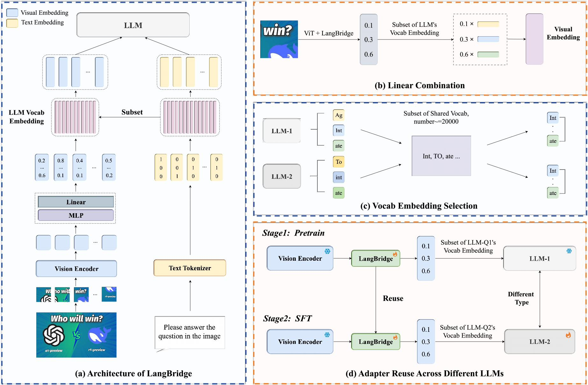

# LangBridge: Interpreting Image as a Combination of Language Embeddings

Official implementation of the paper "LangBridge: Interpreting Image as a Combination of Language Embeddings" accepted at **ICCV 2025**.

[**Paper**](https://arxiv.org/abs/2503.12271) | [**Project Page**](hhttps://curryx-001.github.io/LangBridge.github.io/) | [**Models**](#-models)

## 🔥 News

- **[2025-06]** LangBridge paper accepted at ICCV 2025!
- **[2025-06]** Code and models released!

## 📖 Abstract

We propose **LangBridge**, a novel adapter that explicitly maps visual tokens to linear combinations of LLM vocabulary embeddings. This design enables pretraining-free adapter transfer across different LLMs while maintaining competitive performance.



## 🛠️ Installation
We use CUDA 11.8

```bash
git clone https://github.com/CurryX-001/LangBridge.git
cd LangBridge

# Create environment
conda create -n langbridge python=3.10 -y
conda activate langbridge
pip install --upgrade pip

# Install package
pip install -e .

# Install additional packages for training
pip install -e ".[train]"
pip install https://github.com/Dao-AILab/flash-attention/releases/download/v2.6.3/flash_attn-2.6.3+cu118torch2.1cxx11abiFALSE-cp310-cp310-linux_x86_64.whl --no-build-isolation --no-cache-dir
```

## 📊 Data Preparation

### 1. Download the Pretraining Data and Visual Instruction Tuning Data, and Evaluation Data

Download the annotation file for final mixture instruction tuning data [llava_v1_5_mix665k.json](https://huggingface.co/datasets/liuhaotian/LLaVA-Instruct-150K/resolve/main/llava_v1_5_mix665k.json), and download the images from constituting datasets:

- **LLaVA-Pretrain**: [images](https://huggingface.co/datasets/liuhaotian/LLaVA-Pretrain)
- **COCO**: [train2017](http://images.cocodataset.org/zips/train2017.zip)
- **GQA**: [images](https://downloads.cs.stanford.edu/nlp/data/gqa/images.zip)
- **OCR-VQA**: [download script](https://huggingface.co/datasets/ej2/llava-ocr-vqa/blob/main/ocr_vqa.tar), we save all files as `.jpg`
- **TextVQA**: [train_val_images](https://dl.fbaipublicfiles.com/textvqa/images/train_val_images.zip)
- **VisualGenome**: [part1](https://cs.stanford.edu/people/rak248/VG_100K_2/images.zip), [part2](https://cs.stanford.edu/people/rak248/VG_100K_2/images2.zip)

After downloading all of them, organize the data as follows in `./playground/data`:

```text
├── coco
│   └── train2017
├── LLaVA-Pretrain
│   └── images
├── gqa
│   └── images
├── ocr_vqa
│   └── images
├── textvqa
│   └── train_images
└── vg
    ├── VG_100K
    └── VG_100K_2
```

You can download training data using the provided script:

```bash
bash scripts/download_data.sh
```

## 🎨 Visualization Code

### Progressive Training Visualization
```bash
bash scripts/vis.sh
```

## 🚀 Training

### 1. Extract Model Embeddings

Extract input **embeddings** from pretrained models and process them with vocabulary mappings:

```bash
# Extract embeddings for Llama3-8B with 19200 vocab
python scripts/get_input_embeddings.py \
    --model_name "meta-llama/Meta-Llama-3-8B-Instruct" \
    --vocab_path "vocab/19200_llama3_sub_llava_share_intersect_llama_qwen.json" \
    --output_dir "./embeddings"

# Extract embeddings for Qwen2-7B with 19200 vocab  
python scripts/get_input_embeddings.py \
    --model_name "Qwen/Qwen2-7B-Instruct" \
    --vocab_path "vocab/19200_Qwen_sub_llava_share_intersect_llama_qwen.json" \
    --output_dir "./embeddings"
```

To generate different vocabulary sizes, use:

```bash
# Create vocabulary subsets with different sizes
python scripts/create_vocab_subset.py --vocab_size 19200 --model_name llama3
python scripts/create_vocab_subset.py --vocab_size 25600 --model_name llama3
python scripts/create_vocab_subset.py --vocab_size 32000 --model_name llama3

python scripts/create_vocab_subset.py --vocab_size 19200 --model_name Qwen
python scripts/create_vocab_subset.py --vocab_size 25600 --model_name Qwen
python scripts/create_vocab_subset.py --vocab_size 32000 --model_name Qwen
```
### 2. Model Training

Train the LangBridge model using the provided training scripts:

```bash
# For Llama3-based models
bash scripts/examples/llama3/train_langbridge.sh

# Example training configurations available:
# - scripts/examples/llama3/pretrain.sh
# - scripts/examples/llama3/finetune.sh
# - scripts/examples/llama3/multimodel_training.sh
```

For detailed training configurations and advanced options, refer to the example scripts in `scripts/examples/llama3/`.

## 📊 Evaluation

Evaluate trained models across multiple benchmarks:

```bash
bash scripts/evaluate_all.sh
```

For LLaVA-Next specific training and evaluation protocols, refer to `./LLaVA-NeXT/Instruction.md`.

## 🏆 Models

Pre-trained models are available for download:

| LLM | Connector | Model Type | Download |
|-------|----------|------------|----------|
| Qwen2-7B | Qwen2-7B-Pretrain-MLP | LLaVA-Next | [ModelScope](https://modelscope.cn/models/ljqnb7799/llava-next-baseline-normal-mlp-qwen2-7b-it-new-test) |
| Qwen2-7B | Qwen2-0.5B-Pretrain-LangBridge | LLaVA-Next | [ModelScope](https://modelscope.cn/models/ljqnb7799/llava-next-baseline-mmvocab-mlp-qwen2-7b-it-new-test_0.5B) |

## 📄 Citation

```bibtex
@article{liao2025langbridge,
  title={LangBridge: Interpreting Image as a Combination of Language Embeddings},
  author={Liao, Jiaqi and Niu, Yuwei and Meng, Fanqing and Li, Hao and Tian, Changyao and Du, Yinuo and Xiong, Yuwen and Li, Dianqi and Zhu, Xizhou and Yuan, Li and others},
  journal={arXiv preprint arXiv:2503.19404},
  year={2025}
}
```

## 📧 Contact

For questions, please open an issue or contact: [godubnation7@gmail.com](mailto:godubnation7@gmail.com)
